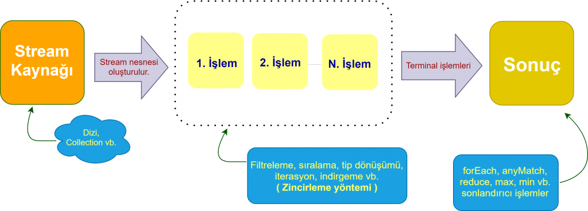
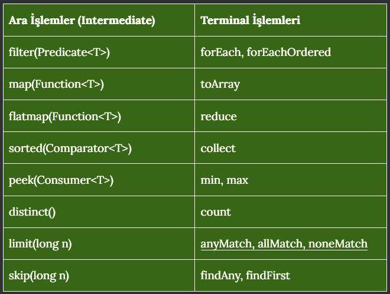

# Kafein Egitim

Giriş: Stream Kütüphanesi ve Örnekleri

## Stream Kütüphanesi:

### Stream Nedir
-   Akış bir veri yapısı değildir, elemanları depolamaz, sadece kendisinden
    üretildiği kaynaktaki elemanlara işaret eder (point), işlemleri elemanlara
    iletir (convey)
    
-   Akış, fonksiyonel bir tabiattadır, yani kaynağını değiştirmez. üzerinde
    çalıştığı elemanları ve elemanların içinde olduğu yapıyı değiştirmez,
    sadece işler gerekirse yeni elemanlar üretir
    
-   Akış, işlemlerini gerektikçe yapar (lazy), gerekmedikçe yapmaz

-   #### Hedef
    *   Bir bir dizi (array), torba (collection), üretici bir fonksiyon (generator function), dosya ya da soket (socket) gibi bir giriş-çıkış kanalı (I/O channel) olabilir

### Strem (Akış)
-   Kaynaktan akışın oluşturulması
-   Akışın işlemler vasıtasıyla sıfır ya da daha fazla kere işlenmesi
-   Ve akışın bitirici bir son işlemle kapatılması
-   Akışı işleyen işlemcilere ara işlemci (intermediate operation), akışı
    kapatan işlemciye ise son işlemci ya da bitirici işlemci (terminal
    operation) denir

    

    
### Ara İşlemler
-   Ara işlemler (intermediate operations), akışlar üzerinde tanımlanmış ve
    akışın temsil ettiği kaynaktaki elemanları işleyen, yüksek-seviyeli
    metotlardır
    
-   Akış, kaynaktaki elemanları değiştirmez, onları eleyebilir, onlardan yeni
    elemanlar üretebilir ya da hesaplamalar yoluyla sonuçlar çıkarabilir
    ama elemanların kendisini değiştirmez
    
1. Ara Elemanlar
   1. filter(Predicate<T>)
   2. map(Function<T>) (mapToInt,mapToLong,mapToDouble)
   3. flatmap(Function<T>)(flatMapToInt,flatMapToLong,flatMapToDouble)
   4. sorted(Comparator<T>)
   5. peek(Consumer<T>)
   6. distinct()
   7. limit(long n)
   8. skip(long n)

### Filter
#### Belirteceğimiz koşullar doğrultusunda filtreleme işlemi yapmamıza yarayan bir yapıdır. Predicate arayüzünden türüyen bir parametre bekler. Bu işlem sonrası belirttiğimiz koşula uygun olmayan elemanlar bir sonraki aşamada kullanılamazlar. Artık elimizde filtrelenmiş/süzülmüş/elenmiş bir veri vardır.

### Map
#### Stream içerisinde erişilen her bir eleman üzerinde işlem yapmamıza ve başka elemanlara dönüştürmemize imkan sağlayan map metodu parametre olarak Function arayüzünden türetilmiş bir ifade beklemektedir.

### Flatmap
#### Stream’i başka bir stream’e çevirmek için kullanılır. Bir giren değere karşılık birden fazla değer olabilir. Input olarak Function<Personnel, Stream<R>> interface’ini alır.

### SORTED
#### Elimizde ki veri setini belirli bir parametreye göre sıralamak isteyebiliriz. 2 türü bulunmaktadır. Birinci hali parametre almaz küçükten büyüğe şekilde sıralar. İkinci formatı ise Comparator arayüzünden türediği için bizim belirlemiş olduğumuz parametreye göre sıralama işlemi yapar.

### Peek
#### Bu yöntem, temel olarak, öğeleri bir işlem hattında belirli bir noktadan geçerken görmek istediğiniz hata ayıklamayı desteklemek için vardır.

### DISTINCT
#### Stream içerisinde bulunan ve tekrar eden elemanlar varsa bunları distinct metodu ile çıkartabilir ve elimizde tekrar etmeyen birbirinden farklı elemanlar barından bir veri setimiz kalır.

### Limit
#### Bir veri kaynağını, göstermek istediğimiz kadarını göstermemize yarayan, sınırlandıran bir metoddur.

### Skip
#### Bir akışın ilk n öğesini atan bir ara işlemdir . n parametresi negatif olamaz ve akışın boyutundan büyükse, jump() boş bir akış döndürür.

### Bitirici İşlem
-   Ara işlemlerden sonra akışı bitiren, son-bitirici işlem (terminal
    operation) gelir.
-   Son işlemler akış üretmez, işlemin tabiatına göre void ya da bir
    tipte sonuç döndürebilir, ya da bir torba nesne oluşturabilir, vs

  1. Bitirici Elemanlar
     1. The allMatch() operation
     2. The anyMatch() operation
     3. The noneMatch() operation
     4. The collect() operation
     5. The count() operation
     6. The forEach() operation
     7. The min() operation
     8. The max() operation
     9. The reduce() operation

### allMatch
#### Akış içerisinde verilen koşula göre tüm elemanlar eşlenirse true döner.

### anyMatch
#### Akış içerisinde verilen koşula göre herhangi bir eleman eşlenirse true döner.

### noneMatch
#### Akış hiçbir elemanın içerisinde verilen koşula uymuyorsa  true döner.

### Collect
####  Stream türündeki nesneleri başka biçimdeki nesneye, veri yapısına dönüştürmek için kullanılır. Collector arayüzünden türeyen bir parametre beklemektedir.

### Count
#### Akış içerisinde ki öğelerin sayısını döndürür.

### ForEach
#### Akışın her elemanı için verilecek (Consumer<? super T> action) eylemi gerçekleştirir.

### Min
#### Akışa verilecek Comparator'a (Comparator<? super T> comparator) göre minimum ögesini döndürür.

### Max
#### Akışa verilecek Comparator'a (Comparator<? super T> comparator) göre maximum ögesini döndürür.

### Reduce
####  Teker teker işleme sürecinde, bir önceki adımda elde edilen sonuç bir sonraki adıma girdi olarak sunulmaktadır. Bu sayede yığılmlı bir hesaplama süreci elde edilmiş olmaktadır.

##Paralel Stream
#### Stream arayüzü içindeki metodlardan ardışık işletilmesi gerekmeyenler, istenirse, CPU üzerinde paralel olarak koşturulabilmektedir. Bu sayede CPU çekirdeklerini tam verimli olarak kullanmak mümkün olmaktadır.

## Stream Avantajları
#### Daha az kod 
#### Birçok fonksiyonu bulunur ve bunları diledigimiz gibi şekillendirebiliriz
#### Daha az degişebilirgi temsil eder.
#### Paralelleştirmeyi kolaylaştırır ve bazı durumlarda performans artışı saglar.
#### Sistematikleştirme ve mimari yapı kurulmasında tercih sebebi olabilir

## Stream Dezavantajları
#### Hız ve hafıza tasarrufu açısında kötüdür. (Yerine for tercih sebebidir)
#### Aşinalık (Streamlerin Java 8 ile gelmiştir lakin for kullanımı her zaman developer için daha aşina gözükür)
#### Debug (debug yaparken for daha anlaşılır bir performans sunuyor)
#### Bilişsel ek yük (Sagladıgı esneklik ve soyutlama ile aslında bizi farklı şekilde düşünmeye zorluyor. Bu durum karmaşık durumlarda can sıkıcı olabilir)

## Best Practice

#### int, long ve double gibi ilkel türlerle çalışırken Integer, Long ve Double gibi kutulu türlerin akışları yerine IntStream , LongStream ve DoubleStream gibi ilkel akışları kullanın.
#### Paralel akışları dikkatli kullanın
#### Stream API, veriler üzerinde işlevsel işlemler gerçekleştirmek için tasarlanmıştır. Öngörülemeyen davranışlara yol açabileceğinden ve kod okunabilirliğini azaltabileceğinden, akışın dışındaki değişkenleri değiştirmek veya G/Ç işlemleri gerçekleştirmek gibi yan etkileri ortaya çıkarmaktan kaçının.
#### Akışları değişmez nesnelerle kullanın
#### Yöntem referanslarını lambda ifadelerine tercih edin
#### Yinelenenleri kaldırmak için distinct() kullanın

#Kaynaklar
#### https://www.codejava.net/java-core/collections/java-8-stream-terminal-operations-examples
#### https://docs.oracle.com/javase/8/docs/api/java/util/stream/Stream.html
#### https://kodedu.com/2014/10/java-8-stream-api/
#### https://farukgenc.com/java/java-8-yenilikleri-bolum-3.html
#### https://howtodoinjava.com/java8/comparator-example-lambda/

        
